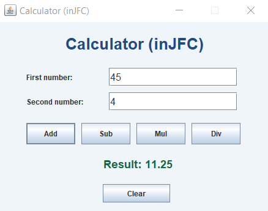

# Java Swing (JFC) Calculator

A simple desktop calculator built using **Java Swing (JFC)** to explore GUI development concepts like layouts, event handling, dialogs, and input validation.

## Features
- Basic operations: **Add, Subtract, Multiply, Divide**
- **Input validation** for invalid/empty values
- **Divide-by-zero protection** with warning dialog
- **Clear** button to reset inputs and result
- Uses Swing best practice: runs UI on the **Event Dispatch Thread (EDT)**

## Tech Stack
- **Java**
- **Swing (JFC), AWT**
- Eclipse IDE (for development)

## Screenshot


## How to Run

### Option A: Run in Eclipse
1. Open Eclipse → **File → Import → Existing Projects into Workspace**
2. Select the project folder
3. Open `src/SimpleCalculator.java`
4. Click **Run ▶** (Run As → Java Application)

### Option B: Run from Command Line
> Make sure Java is installed and added to PATH.

```bash
javac -d out src/SimpleCalculator.java
java -cp out SimpleCalculator
